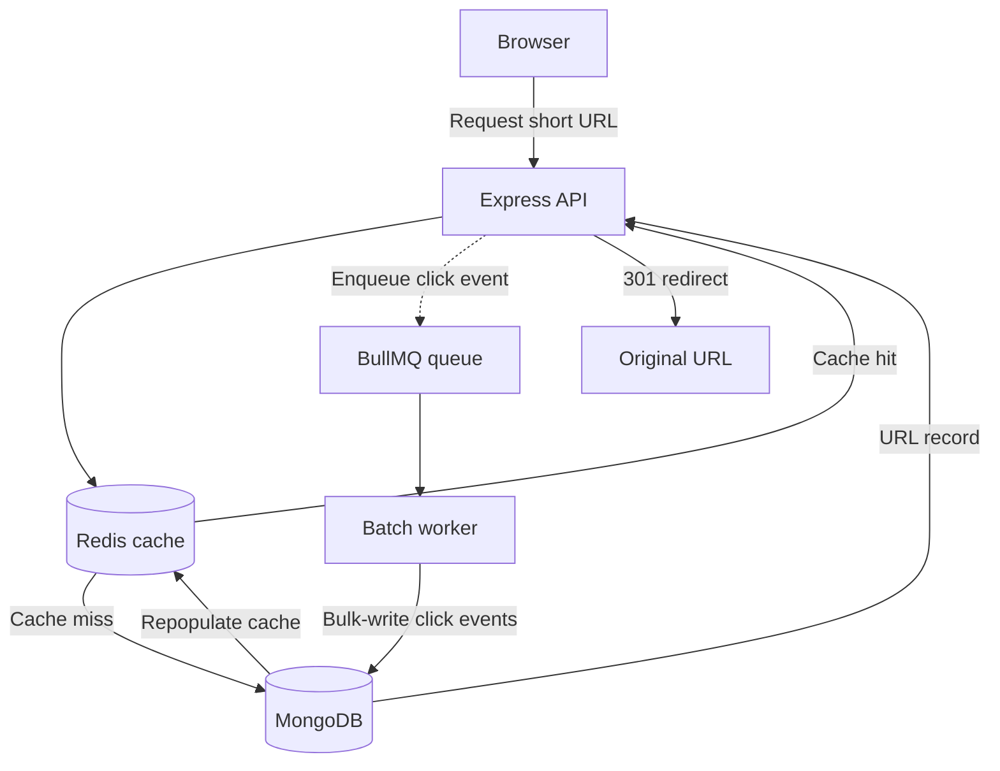

# SnapLink

SnapLink is a full-stack URL shortener with a React dashboard, cache-first redirects, and asynchronous click analytics.

## Features

- Create short URLs with generated Base62 slugs or custom alphanumeric slugs.
- Manage links and view click analytics in the React dashboard.
- Redirect through Redis with a MongoDB fallback and soft-expiry validation.
- Capture clicks asynchronously with BullMQ, then batch-write them to MongoDB.
- View total clicks, 30-day trends, top referrers, and top countries.
- Apply sliding-window rate limits to shortening, redirect, and analytics requests.
- Monitor service health and BullMQ queues.
- Automatically remove expired URLs and old click records with MongoDB TTL indexes.

## Project structure

```
.
├── backend/    # Express API, BullMQ worker, MongoDB, and Redis integrations
├── frontend/   # React + TypeScript + Vite dashboard
└── .env.example
```

## Tech stack

| Area | Technology |
| --- | --- |
| Frontend | React, TypeScript, Vite, Tailwind CSS, React Query, Chart.js |
| API | Node.js, Express, Zod |
| Data | MongoDB and Mongoose |
| Cache and queues | Redis and BullMQ |
| Operations | Docker Compose, Bull Board, Helmet, Morgan |

## Architecture

The dashboard communicates with the Express API. For a redirect, the API checks Redis first and falls back to MongoDB on a cache miss. Redirects enqueue click events without blocking the response; a BullMQ worker batches those events into MongoDB.



## Local development

### Prerequisites

- Node.js 20.19 or later
- Docker and Docker Compose (for MongoDB and Redis)

### 1. Configure the backend

The backend loads its environment file from the `backend` directory. Create it from the root template:

```bash
cp .env.example backend/.env
```

Update `backend/.env` for local development:

```dotenv
MONGODB_URI=mongodb://localhost:27017/url-shortener
REDIS_URL=redis://localhost:6379
BASE_URL=http://localhost:3000
FRONTEND_URL=http://localhost:5173
NODE_ENV=development
```

Install backend dependencies and start MongoDB and Redis:

```bash
cd backend
npm install
docker-compose up -d mongo redis
```

In one terminal, start the API:

```bash
cd backend
npm start
```

In another terminal, start the analytics worker:

```bash
cd backend
npm run start:worker
```

### 2. Configure and start the frontend

Create `frontend/.env` to point the dashboard and redirect route at the backend:

```dotenv
VITE_API_URL=http://localhost:3000
VITE_BASE_URL=http://localhost:3000
```

Then install dependencies and run Vite:

```bash
cd frontend
npm install
npm run dev
```

Open the address Vite prints (normally `http://localhost:5173`).

## Environment variables

### Backend (`backend/.env`)

| Variable | Required | Description | Local example |
| --- | --- | --- | --- |
| `MONGODB_URI` | Yes | MongoDB connection string | `mongodb://localhost:27017/url-shortener` |
| `REDIS_URL` | Yes | Redis connection string | `redis://localhost:6379` |
| `BASE_URL` | Yes | Public backend URL used in generated short links | `http://localhost:3000` |
| `FRONTEND_URL` | Yes | Allowed frontend origin for CORS | `http://localhost:5173` |
| `NODE_ENV` | No | `development`, `test`, or `production` | `development` |

### Frontend (`frontend/.env`)

| Variable | Required | Description | Local example |
| --- | --- | --- | --- |
| `VITE_API_URL` | No | Backend API base URL; defaults to `http://localhost:3000` | `http://localhost:3000` |
| `VITE_BASE_URL` | No | Backend URL used by the frontend redirect route | `http://localhost:3000` |

## API endpoints

| Method | Path | Description |
| --- | --- | --- |
| `POST` | `/api/shorten` | Create a shortened URL. Body: `{"url":"https://example.com"}` |
| `GET` | `/api/urls` | List shortened URLs. Supports `limit` and `skip` query parameters. |
| `GET` | `/api/analytics/:slug` | Get analytics for a short URL. |
| `GET` | `/:slug` | Redirect to the original URL with `301 Moved Permanently`. |
| `GET` | `/health` | Report MongoDB, Redis, and queue health. |
| `GET` | `/admin/queues` | Open the Bull Board queue dashboard. |

Common error responses are `400` for invalid input, `404` for missing or expired slugs, `409` for an already-used custom slug, `429` for rate limits, and `503` when a dependency is unavailable.

## Scripts

### Backend

Run these inside `backend/`.

| Command | Description |
| --- | --- |
| `npm start` | Start the Express API. |
| `npm run start:worker` | Start the click-event worker. |
| `npm test` | Run the test suite. |
| `npm run lint` | Lint backend code. |
| `npm run seed` | Seed test data. |

### Frontend

Run these inside `frontend/`.

| Command | Description |
| --- | --- |
| `npm run dev` | Start the Vite development server. |
| `npm run build` | Type-check and create a production build. |
| `npm run lint` | Lint frontend code. |
| `npm run preview` | Preview the production build locally. |

## Deployment

Deploy the Express API and worker as separate Node.js services, backed by managed MongoDB and Redis. Deploy `frontend/` as a static Vite site. Configure the backend `BASE_URL` to its public URL, set `FRONTEND_URL` to the deployed frontend origin, and set the frontend `VITE_API_URL` and `VITE_BASE_URL` to the public backend URL.
