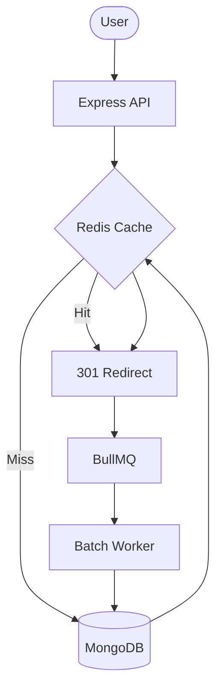

# SnapLink

A production-grade URL shortener featuring a write-behind caching architecture and an asynchronous analytics pipeline.

## Table of Contents
- [SnapLink](#snaplink)
  - [Table of Contents](#table-of-contents)
  - [Features](#features)
  - [Architecture](#architecture)
  - [Tech Stack](#tech-stack)
  - [Setup / Installation](#setup--installation)
  - [Environment Variables](#environment-variables)
  - [API Endpoints](#api-endpoints)
    - [Error Reference](#error-reference)
    - [Monitoring](#monitoring)
  - [Running Tests](#running-tests)
    - [Seeding Data](#seeding-data)
  - [Deployment](#deployment)


## Features

- URL shortening with default 7-character Base62 slugs or custom alphanumeric slugs.
- Redis-first redirection with MongoDB fallback and soft-expiry validation.
- Asynchronous click analytics ingestion using BullMQ to prevent redirect blocking.
- Write-behind caching with batch-flushing of click events to MongoDB.
- Analytics API providing total clicks, 30-day daily trends, top referrers, and top countries.
- Sliding window rate limiting for shortening and redirect endpoints.
- System health monitoring via `/health` endpoint.
- Queue observability through Bull Board integration.
- Automatic data cleanup using MongoDB TTL indices for expired URLs and old click records.

## Architecture

The system employs a cache-first strategy for redirects: requests check Redis first, falling back to MongoDB on a miss. Click analytics are processed asynchronously; the redirect handler pushes events to a BullMQ queue, which a worker then batches and flushes to MongoDB using bulk writes to minimize database load.




## Tech Stack

| Layer | Technology | Purpose |
|---|---|---|
| Runtime | Node.js | Application environment |
| Framework | Express.js | API server |
| Cache | Redis | URL caching, rate limiting, and queue backend |
| Queue | BullMQ | Asynchronous click event processing |
| Database | MongoDB | Persistent storage for URLs and analytics |
| Validation | Zod | Request schema validation |
| Security | Helmet.js | Secure HTTP response headers |

## Setup / Installation

1. Clone the repository.
2. Install dependencies:
   ```bash
   npm install
   ```
3. Create a `.env` file based on `.env.example`.
4. Start infrastructure using Docker Compose:
   ```bash
   docker-compose up -d
   ```
5. Start the application:
   ```bash
   npm start
   ```

## Environment Variables

| Variable | Required | Description | Example |
|---|---|---|---|
| `MONGODB_URI` | Yes | MongoDB connection string | `mongodb://localhost:27017/url-shortener` |
| `REDIS_URL` | Yes | Redis connection string | `redis://localhost:6379` |
| `BASE_URL` | Yes | Base URL for generated short links | `http://localhost:3000` |
| `NODE_ENV` | No | Environment mode (`development`, `test`, `production`) | `development` |

## API Endpoints

| Method | Path | Description | Example Request/Response |
|---|---|---|---|
| `POST` | `/api/shorten` | Shorten a long URL | **Req:** `{"url": "https://example.com"}` <br> **Res:** `{"slug": "abc1234", "shortUrl": "..."}` |
| `GET` | `/:slug` | Redirect to original URL | **Res:** `301 Redirect` |
| `GET` | `/api/analytics/:slug` | Get analytics for a slug | **Res:** `{"totalClicks": 10, "clicksPerDay": [...], ...}` |
| `GET` | `/health` | Check system health | **Res:** `{"status": "ok", "redis": "connected", ...}` |
| `GET` | `/admin/queues` | Access Bull Board UI | **Res:** HTML Page |

### Error Reference

| Status | Condition |
|---|---|
| `400` | Invalid URL or slug format |
| `404` | Slug not found or expired |
| `409` | Custom slug already taken |
| `429` | Rate limit exceeded |
| `503` | Service unavailable (Database/Cache connection failed) |

### Monitoring

- **Health Check**: Use `GET /health` to monitor the connectivity status of Redis and MongoDB.
- **Queue Dashboard**: Access Bull Board at `/admin/queues` to monitor job failure counts, queue depth, and the Dead Letter Queue (DLQ).


## Running Tests

```bash
npm test
```

The test suite includes:
- **Integration Tests**: Validates end-to-end flows for shortening, redirection, analytics retrieval, and system health.
- **Rate Limiter Tests**: Ensures sliding window logic correctly allows/blocks requests and fails open during Redis outages.
- **Slug Utilities Tests**: Verifies Base62 encoding and the uniqueness of generated slugs.
- **Validation Tests**: Checks request schema enforcement using Zod.

### Seeding Data

To populate the database with initial test data, run:
```bash
npm run seed
```


## Deployment

The system is designed for deployment on Railway and MongoDB Atlas:

- **Backend API**: Deployed as a Node.js service on Railway (auto-deploy from `main` branch).
- **Cache**: Railway Redis plugin for URL caching and BullMQ.
- **Database**: MongoDB Atlas for persistent storage.
- **Frontend Dashboard**: Deployed as a static site on Vercel.

Required production environment variables: `MONGODB_URI`, `REDIS_URL`, `BASE_URL`, and `NODE_ENV=production`.
